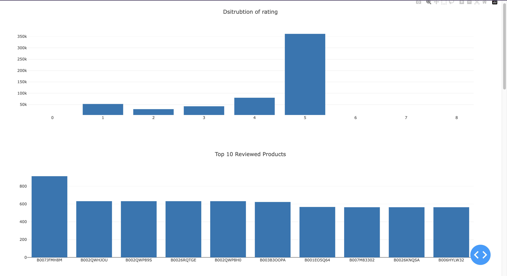

# Analyse des avis produits d'Amazon

## Problématique
Comment les avis et évaluations des produits sur Amazon évoluent-ils sur une période donnée et quelles sont les tendances ou patterns observables ?

## Objectif

Le but de ce projet est de mettre en place une infrastructure Big Data pour traiter et analyser de grandes quantités de données, pour fournir une vue complète des tendances des avis d'Amazon, permettant ainsi aux utilisateurs, vendeurs et aux décideurs de comprendre les préférences et opinions des consommateurs.
Nous avons opté pour architecture distribuée pour traiter et stocker les données, et une application interactive pour visualiser les résultats. 

## Approche et Outils

### Données
- **Source** : L'ensemble de données Amazon Product Review](https://www.kaggle.com/datasets/arhamrumi/amazon-product-reviews/) récupéré depuis Kaggle. Il s'agit d'un ensemble historique d'avis laissés par les utilisateurs d'Amazon.

### Traitement des Données
- **Apache Spark** : Utilisé pour le traitement en lots (Batch Processing) de l'ensemble de données, vu sa grande taille et la nature historique de celui-ci. Spark permet d'extraire efficacement des tendances telles que les produits les plus appréciés et les catégories les plus commentées.

### Visualisation
- **Dash/Grafana** : Un tableau de bord interactif conçu avec Dash ou Grafana sera utilisé pour afficher les insights de l'analyse. Cela permet une visualisation claire et interactive des tendances et patterns observables dans les avis produits d'Amazon.

## Justification du choix par Batch
L'ensemble de données [Amazon Product Review](https://www.kaggle.com/datasets/arhamrumi/amazon-product-reviews/) est essentiellement un vaste ensemble d'avis historiques. Les données batch sont idéales pour analyser de gros volumes de données accumulées pour en extraire des tendances. En utilisant cette approche, nous pouvons identifier les produits les plus appréciés (ou les moins appréciés), examiner les tendances des critiques au fil du temps, et même effectuer une analyse de sentiment pour comprendre l'humeur générale des critiques pour certains produits ou catégories.

## Prérequis

- Assurez-vous d'avoir installé sur votre machine les outils suivants:
    - [Docker et Docker-Compose](https://docs.docker.com/get-docker/)
    - [Python 3.8](https://www.python.org/downloads/)
    - [Pip](https://pip.pypa.io/en/stable/installing/)


## Choix des Composants / Outils

Pour répondre à cette problématique, les composants suivants ont été sélectionnés :

- **Hadoop** : Un framework qui permet de traiter de grandes quantités de données de manière distribuée.
- **Spark** : Une plateforme de traitement de données rapide qui peut être utilisée avec Hadoop pour traiter des données en temps réel.
- **Docker** : Un outil qui permet de conteneuriser les applications et leurs dépendances pour garantir une installation rapide et sans problème.

### Docker Compose
Le fichier `docker-compose` décrit l'infrastructure que vous avez mise en place pour faire fonctionner votre projet :

- **Namenode & Datanode** : Ces services utilisent l'image Docker `apache/hadoop:3` pour mettre en place un système de fichiers distribué HDFS (Hadoop Distributed File System). Le Namenode stocke la structure du répertoire du fichier et la métadonnée pour tous les fichiers, tandis que le Datanode stocke les données réelles.

- **Resourcemanager & Nodemanager** : Ces services sont également basés sur l'image `apache/hadoop:3` et mettent en place YARN (Yet Another Resource Negotiator) pour la gestion des ressources et la planification des jobs.

- **Spark Master & Spark Worke**r : Ces services sont basés sur l'image Docker `bitnami/spark:latest` et établissent un environnement Spark pour le traitement distribué des données. Le Spark Master coordonne la distribution des tâches, tandis que le Spark Worker exécute les tâches individuelles.

La mise en réseau est assurée par un réseau Docker personnalisé de type bridge, appelé `hadoop_net`.

### Configuration
La configuration fournie (dans `config`) définit divers paramètres pour le fonctionnement correct de Hadoop et YARN, comme les adresses des services, les paramètres de réplication et d'autres configurations spécifiques.

### Traitement avec Spark

Le script `spark_processing.py` initialise une session Spark, charge les données depuis HDFS, nettoie ces données, et réalise plusieurs analyses :

1. **Compte des avis par score** : Agrège les avis en fonction de leurs scores.
2. **Les 10 produits les plus commentés** : Liste les 10 produits ayant reçu le plus d'avis.
3. **Les 10 utilisateurs les plus actifs** : Montre les 10 utilisateurs ayant donné le plus d'avis.
4. **Avis groupés par date** : Organise les avis selon la date à laquelle ils ont été donnés.
5. **Analyse de sentiment** : Évalue le sentiment (positif, neutre, négatif) de chaque avis à l'aide de la bibliothèque TextBlob.
6. **Fréquence des mots** : Analyse et liste les mots les plus fréquemment utilisés dans les avis, après avoir retiré les mots d'arrêt courants.

Après la réalisation de ces analyses, les résultats sont sauvegardés sur HDFS sous forme de fichiers CSV respectifs.

#### Bibliothèques utilisées :
- **PySpark** : Utilisé pour l'initialisation de la session Spark et pour les opérations de traitement des données.
- **TextBlob** : Une bibliothèque pour le traitement du texte, utilisée ici pour l'analyse de sentiment.
- **Spark SQL Functions** : Fonctions intégrées à PySpark pour le traitement des données et les transformations.

Les résultats sont ensuite enregistrés dans HDFS.

### Dash App
Le script `dash_app` est une application interactive construite avec Dash pour visualiser les résultats obtenus à partir du script de traitement Spark. Le script récupère les données depuis HDFS et les affiche dans un tableau de bord interactif.


## Mise en marche avec le script

Pour exécuter le script, il suffit de taper la commande suivante dans le terminal :

```bash
./build-project.sh
```

## Visualisation des résultats

Une fois le script exécuté, vous pouvez accéder à l'application [Dash](http://0.0.0.0:8051/) en ouvrant le lien suivant dans votre navigateur :

```bash
http://0.0.0.0:8051/
```


## Note Importante

Si le datanode n'arrive pas à se connecter au namenode, faudra relancez le script `build-project.sh` en réexécutant au dessus.

## Détails d'Installation

### Script Bash d'Initialisation

Le script a pour but de:

1. Démarrer l'infrastructure avec Docker.
2. Copier les fichiers nécessaires vers les conteneurs appropriés.
3. Vérifier la connexion entre le datanode et le namenode.
4. Installer les dépendances requises.
5. Exécuter des commandes HDFS pour préparer le stockage des données.
6. Exécuter des scripts pour le traitement de données et le lancement d'une application Dash.

### Détails du Script

```bash
#!/bin/bash
# ... [le contenu complet de votre script bash ici] ...
#!/bin/bash

# Start the docker-compose
docker-compose up -d

# Copy the Reviews.csv file to the namenode container
docker cp ./Reviews.csv project-big-data-dia-diallo-namenode-1:/tmp/

# Copy the Spark script and Dash app to the spark-master container 
docker cp ./spark_processing.py project-big-data-dia-diallo-spark-master-1:/tmp/
docker cp ./dash_app.py project-big-data-dia-diallo-spark-master-1:/tmp/

# Check if datanode is connected to namenode
# This loop ensures that HDFS commands are executed only when the datanode is connected to the namenode, 
# preventing potential errors due to unestablished connections.
echo "Waiting for datanode to connect to namenode..."
while true; do
    DATANODE_STATUS=$(docker exec project-big-data-dia-diallo-namenode-1 hdfs dfsadmin -report 2>&1 | grep "Live datanodes")
    echo "DATANODE_STATUS: $DATANODE_STATUS" # Pour le débogage, vérifier le statut du datanode
    if [[ $DATANODE_STATUS == *"Live datanodes (1):"* ]]; then
        break
    else
        echo "Datanode not yet connected. Retrying in 10 seconds..."
        sleep 10
    fi
done
echo "Datanode is connected to namenode."


# Install dependencies for Dash in spark master
# To be executed in spark-master
docker exec -it project-big-data-dia-diallo-spark-master-1 bash -c "
pip install dash dash-core-components dash-html-components dash-renderer dash-bootstrap-components pandas plotly pyspark findspark
"
# Connect to the namenode container and execute HDFS commands
# We need to grant write permisions for the user spark to be able to put the 
# processed data in the HDFS 
# Because I had this error when I lauched the script:
# Permission denied: user=spark, access=WRITE, inode="/":hadoop:supergroup:drwxr-xr-x 
docker exec -it project-big-data-dia-diallo-namenode-1 bash -c "
hdfs dfs -mkdir -p /data &&
hdfs dfs -put /tmp/Reviews.csv /data/ &&
hdfs dfs -mkdir -p /results &&
hdfs dfs -chown spark:spark /results &&
hdfs dfs -chmod 755 /results
"

# Execute script for data processing
# To be executed in spark-master
docker exec -it project-big-data-dia-diallo-spark-master-1 /opt/bitnami/spark/bin/spark-submit /tmp/spark_processing.py

# Execute script for the Dash app
# To be executed in spark-master
docker exec -it project-big-data-dia-diallo-spark-master-1 /opt/bitnami/spark/bin/spark-submit /tmp/dash_app.py

```

### Explication du Script
- ***Démarrer l'infrastructure avec Docker.***
```bash
docker-compose up -d
```
- ***copier les fichiers nécessaires vers les conteneurs appropriés.***
  - Copier le fichier `Reviews.csv` vers le conteneur `namenode` :
  ```bash
    docker cp ./Reviews.csv project-big-data-dia-diallo-namenode-1:/tmp/
    ```
    - Copier les scripts `spark_processing.py` et `dash_app.py` vers le conteneur `spark-master` :
    ```bash
    docker cp ./spark_processing.py project-big-data-dia-diallo-spark-master-1:/tmp/
    docker cp ./dash_app.py project-big-data-dia-diallo-spark-master-1:/tmp/
    ```
- ***Vérifier la connexion entre le datanode et le namenode.***
    - Cette boucle `while` permet de s'assurer que les commandes HDFS sont exécutées uniquement lorsque le datanode est connecté au namenode, ce qui évite les erreurs potentielles dues à des connexions non établies.
    ```bash
    echo "Waiting for datanode to connect to namenode..."
    while true; do
        DATANODE_STATUS=$(docker exec project-big-data-dia-diallo-namenode-1 hdfs dfsadmin -report 2>&1 | grep "Live datanodes")
        echo "DATANODE_STATUS: $DATANODE_STATUS" # Pour le débogage, vérifier le statut du datanode
        if [[ $DATANODE_STATUS == *"Live datanodes (1):"* ]]; then
            break
        else
            echo "Datanode not yet connected. Retrying in 10 seconds..."
            sleep 10
        fi
    done
    echo "Datanode is connected to namenode."
    ```
- ***Installer les dépendances requises.***
    - Pour installer les dépendances requises pour l'application Dash, nous devons nous connecter au conteneur `spark-master` et exécuter la commande `pip install` :
    ```bash
    docker exec -it project-big-data-dia-diallo-spark-master-1 bash -c "
    pip install dash dash-core-components dash-html-components dash-renderer dash-bootstrap-components pandas plotly pyspark findspark
    "
    ```

- ***Exécuter des commandes HDFS pour préparer le stockage des données.***
    - Pour exécuter des commandes HDFS, nous devons nous connecter au conteneur `namenode` et exécuter les commandes suivantes :
    ```bash
    docker exec -it project-big-data-dia-diallo-namenode-1 bash -c "
    hdfs dfs -mkdir -p /data &&
    hdfs dfs -put /tmp/Reviews.csv /data/ &&
    hdfs dfs -mkdir -p /results &&
    hdfs dfs -chown spark:spark /results &&
    hdfs dfs -chmod 755 /results
    "
    ```
- ***Exécuter des scripts pour le traitement de données et le lancement d'une application Dash.***
    - Pour exécuter le script de traitement de données, nous devons nous connecter au conteneur `spark-master` et exécuter la commande `spark-submit` :
    ```bash
    docker exec -it project-big-data-dia-diallo-spark-master-1 /opt/bitnami/spark/bin/spark-submit /tmp/spark_processing.py
    ```
    - Pour exécuter l'application Dash, nous devons nous connecter au conteneur `spark-master` et exécuter la commande `spark-submit` :
    ```bash
    docker exec -it project-big-data-dia-diallo-spark-master-1 /opt/bitnami/spark/bin/spark-submit /tmp/dash_app.py
    ```

    # Résultats obtenus:

    ## Tableau de bord interactif
    ### Distribution des avis par score et top 10 des produits les plus commentés
    
    
    ### Top 10 des utilisateurs les plus actifs et tendance des avis au fil du temps
    
    
    ### Analyse de sentiment et fréquence des mots
    